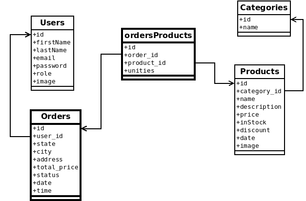

# Develop Your Project With PHP

### Ecommerce With PHP  

This project was developed with the intention of getting me started with OOP with PHP, MySQL and to further develop the knowledge I've acquaride so far with PHP.  

The idea of the project is to create a small ecommerce with PHP and MySQL with the following requirements.
  
## Requirements

- User Registration
- User login
- Categories System
    - Admin can create categories
    - Admin can edit categories
    - Admin can delete categories
    - Categories are added dynamically in the header menu
- Products System
  - Create products
  - Delete products
  - Edit products
- Orders System
  - Dynamic cart
  - Payment Form
- Search System
  - Search all products
- Use MySQL

## Extra Features

- Users can add favorite products
- Users can review products
- Search in specific categories
- Orders Managment
  - Admin can see orders of all users
  - Admin can change order status+
  - Orders history stored in user's profiles
  - Unfinished carts are saved in user's profile

  
## Daily Record  

**06-11 | 08/11**  

Since I proposed myself to use MySQL as Database for this project I decided to first study it before even starting to plan the project, because I had no previous contact with this language before. So the first to days I spent just watching tutorials online and making basic MySQL exercises.  
  
There are no incidents to report during this learning MySQL stage.  

During those two days I studied and saw several examples of MVC architecture in PHP and I though it could be a great opportunity to apply those concepts as well.  
  
**08-11**   
  
After finishing learning about the basics of MySQL I started to plan the project, so the first thing I did was to draw a diagram with the tables scheme for the project.  

  

With the tables diagram in place I created the tables directly in the MySQL console. After that I started setting up the basic config of the project, that includes the .htaccess for firendly URLs, setting up the folders structure for controllers, models and views, connecting PHP with MySQL and basic HTML, CSS and Javascript structure.  
  

**09-11** 

Created a trello to organize how I would divide the tasks and branchs in the project. Worked on the first funcitonality in the list, which was the register and login.  
  
One incident I had during this stage was to link requests being made by javascript to PHP files. I was trying to make requests with javascript and when then the response I was reicived included the information I processed with PHP but also the entire  HTML of the page. The problem was that all the HTML I was reicing through required files. So I understood that I could not have any required files with HTML in the php files that I was going to fetch in javascript.  

**09-11**   
  
Once the login and register was working I went on and started to work on the categories management system. By the end of the day I had the createing new categories feature working.  
  
I had one incident during this part which was an error message I was receiving in the console saying that there was an unexpeccted token '<'. I spent sometime trying to figure it out, turns out it was just a typo in the code.  

I also started to work on the product managemnt system, I was able to finish all the features inside of the products management scope, expect for the views.

**10-11**  
  
Started the day working on products view, I manage to make the views for the home, then display for each category then dipslay of single products page.  
  
One issue I had to fix in this stage was that in the pages that didn't have enough content the footer would not stay in the bottom.  
  
Then I started to work on the cart feature.  
  
**11-11**  
  
Continued working on cart feature. At this stage I also added a PHP library with composer to create a pdf document giving the user to download this pdf containing a summary of the order.  
  
When the cart functionalities were done I started working on the orders managment system. Was able to finishi all the orders management features, except the feature to save the unfinished cart in the user's profile.  
  
After this I worked on the functionalities of deleting and editing categories.  
  
**12-11**  

Added a function of subscription. I was able to collect the email from the users that filled the subscription form and added this email to an external email list Using an API form Active Campaing. The API was consumed by PHP using curl.  

This day we had a MySQL workshop and I had to install MySQL in my operating system because I only had it inside of lampp. I installed MySQL but some kind of conflict between the MySQL inside of lampp and this new MySQL happened and there are a lot of bugs in the project. I wasn't able to perform most of the functionalities and had to spend the rest of the time trying to to fix this issue. I ended up not being able to fix untill I was able to remove the new MySQL from my system and the project came back to work fine again.  
  
## Lessons Learned  

- MVC architecture with PHP
- OOP with PHP
- MySQL basics
- Fiendly urls with .htaccess
- Consume API with curl
- Use PHP libraries with composer
- Hash passwords
- Use the mysqli library
- How to avoid returning wrong data to javascript fetch
- Usage of static methods
  
