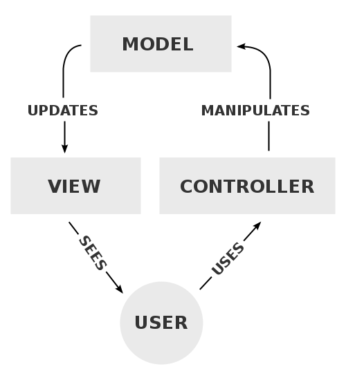

# Develop Your Project With PHP  
  


### Ecommerce With PHP  

This project was developed with the intention of studying Object Oriented Programming with PHP, MySQL and to further develop the knowledge I've acquaride so far with PHP.  

The idea of the project was to create a small ecommerce with PHP and MySQL with the following requirements.  
  
## Requirements

- User Registration
- User login
- Categories System
    - Admin can create categories
    - Admin can edit categories
    - Admin can delete categories
    - Categories are added dynamically in the header menu
- Products System
  - Create products
  - Delete products
  - Edit products
- Orders System
  - Dynamic cart
  - Payment Form
- Search System
  - Search all products

## Getting started  
 
To be able to actually use the app, you need a local server up and running, which can be easily set up with XAMPP, all you need to do is follow those 3 steps:
   
  
1) Head to https://www.apachefriends.org/index.html and click download. 

2) Install XAMPP
  
3) Once it is installed, click on Start the Apache Server and MySQL Database.

 
## Process

To start this project I first planned it's structure since I wanted to use the MVC architecture. The basic idea of this architecture pattern is that you should devide the application into three main sections which are the Model, View and Contreller.  
  
The model is responsible for establishing the connection between application and database. It is the logical part of the application that will manage the data.  
  
The view will be responsible for display the data on screen for the final user to see and interact.  
  
The controller will be the one that will mediate this interaction of information request and information display, it controls what the model should do with the data and which data should be sent to the view.  
  
Here is a diagram of this idea: 

  
  
## Code   

So, the first thing I did after a basic wireframe of the pages was to draw the database tables, since that would be a crucial step to better understand how to approach the coding phase. Here is how the tables were structured:  
  
 
  
Now, to start with the MVC planinng I first had to create a router system. So to do it I edited the .htacess file to look for the controller and the action in the url:

```RewriteRule ^(.*)/(.*) index.php?controller=$1&action=$2```

With that I wrote the code in the index.php to search for the parameters in the url and verify if the controller and/or action existed and were valid, if they were the whole MVC dynamic would occur, otherwise an error would be displayed as feedback to the user. Here is the basic code structure:

```// Check if controller is coming in the URL
if (isset($_GET['controller'])) {
    $controller_name = $_GET['controller'] . 'Controller';

    // this elseif below loads the page automatically 
    //without the need to pass product/index
} elseif (!isset($_GET['controller']) && !isset($_GET['action'])) {
    $controller_name = default_controller;
} else {
    show_error();
    exit();
}

// If controller came, check if the class exists
if (class_exists($controller_name)) {
    $controller = new $controller_name;

    // if class exists, check if the action(which is the method inside the class) exists
    if (isset($_GET['action']) && method_exists($controller, $_GET['action'])) {
        $action = $_GET['action'];
        $controller->$action();

        // this elseif below loads the page automatically 
        //without the need to pass product/index
    } elseif (!isset($_GET['controller']) && !isset($_GET['action'])) {
        $default = default_action;
        $controller->$default();
    } else {
        show_error();
    }
} else {
    show_error();
}
```

So, for example, if you were to access the following url:  

```develop-your-project-php/category/index```  
  
The code would first try to look for the category controller, if it existed it would then look for the index action. Since both of them are valid in this project, here is the code that would be called when the user enters this url:  

```class categoryController{
    public function index(){
        Utils::isAdmin();
        $category = new Category();
        $categories = $category->getCategories();
        require_once 'views/categories/index.php';
    }
```
Inside the category controller the index action would be triggered so that the user can access the categories page. Since this page is only allowed for admins the static method **isAdmin();**  checks if the user has permission to go forward. If he/she has a new instance of the category model will be created and with it the controller will be able to request data from the database. In this case, the **getCategories();** method will return all the categories available. With this information the view is required and will render the page for the final user and will be able to display all the categories.  
  
This is the basic flow that I used througout the entire application. Always check first if controller and action are valid, then trigger the action inside of the controller, request necessary data (or altering necessary data) by creating a new instance of the model and finally rendering the view with the right data. 

## Lessons Learned  

- MVC architecture with PHP
- OOP with PHP
- MySQL basics
- Fiendly urls with .htaccess
- Consume API with curl
- Use PHP libraries with composer
- Hash passwords
- Use the mysqli library
- How to avoid returning wrong data to javascript fetch
- Usage of static methods 
  
## Conclusion  
  
One of the most important takeaways of the project is the experience with the MVC, it really opened my mind for better ways of structuring your code, it can make the life of the developer much easier and make the development process faster.